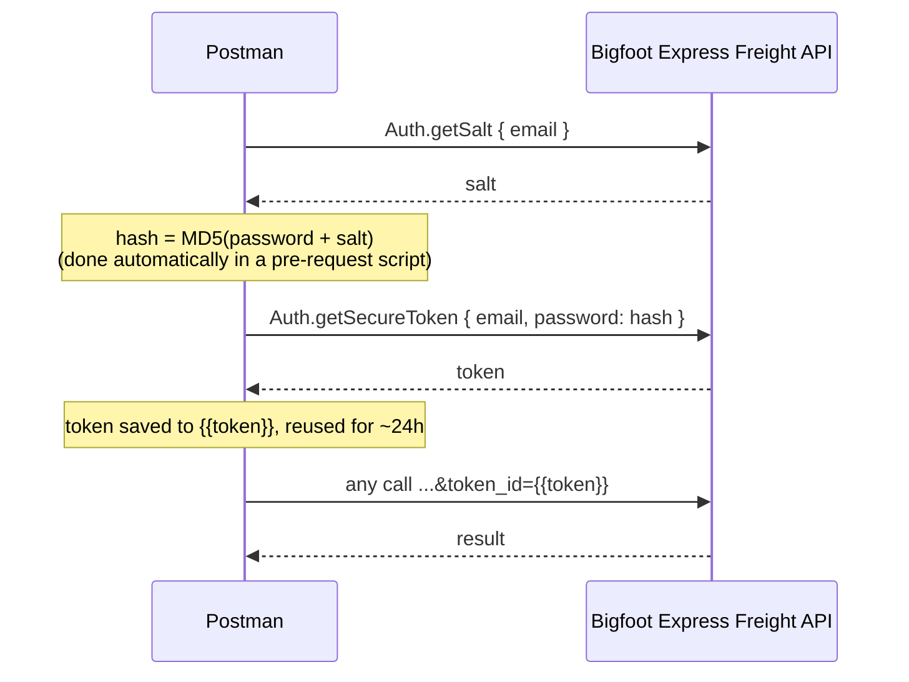
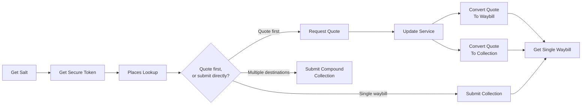

# Bigfoot Express Freight - API Collection

A Postman collection for customers integrating with the Bigfoot Express
Freight shipping API, which is powered by [Parcel Perfect](https://www.parcelperfect.com/)'s
Ecommerce Service (JSON API, v27).

With this collection you can, directly from Postman:

- Authenticate and manage an API session
- Look up valid origin/destination places by postcode or name
- Request freight quotes and convert them into waybills or collections
- Submit collections directly (single waybill or multiple waybills in one run)
- Retrieve an existing waybill's details

## Contents of this repo

```text
.
├── postman/
│   ├── Bigfoot Express Freight API.postman_collection.json     # import this
│   └── Bigfoot Express Freight - My Account.postman_environment.json
└── refs/API/Parcel Perfect/
    ├── Parcel Perfect Ecommerce Service - v27.pdf / .xlsx       # full field-level spec
    └── *.phps.txt                                               # Parcel Perfect's own PHP/SOAP/JSON examples
```

## Requirements

- [Postman](https://www.postman.com/downloads/) (desktop app or web)
- A Bigfoot Express Freight account (username/email, password, and account
  number) — contact your Bigfoot Express Freight account manager if you don't
  have one yet
- Your production `baseUrl` for the service — also provided by Bigfoot
  Express Freight. Until you have it, the collection defaults to Parcel
  Perfect's public demo endpoint, which only accepts demo credentials

## Getting started

1. **Import** both files in [`postman/`](postman/) into Postman
   (`File > Import`, or drag-and-drop).
2. Select the **Bigfoot Express Freight - My Account** environment from the
   environment picker in the top-right of Postman.
3. Click the "eye" icon next to the environment picker (or open the
   environment directly) and fill in your `email`, `password` and `accnum`.
4. Open the collection's **Variables** tab and set `baseUrl` to your
   production service URL.
5. Run **1. Authentication → 1 - Get Salt**, then **2 - Get Secure Token**.
   If both return `errorcode: 0`, you're authenticated — the token is saved
   automatically and every other request in the collection will reuse it.
6. Work through the folders in order (see [Typical workflows](#typical-workflows)
   below) to look up places, get a quote, and submit a shipment.

Every request and folder also has its own description inside Postman
covering its specific parameters — this README is the map, Postman's
descriptions are the detail.

## Configuration variables

Values marked **auto** are populated for you by test scripts as you run
requests — you don't need to set them yourself.

### Environment (`Bigfoot Express Freight - My Account`)

Per-account secrets, kept separate from the shared collection so they're
never accidentally committed or shared alongside it.

| Variable | Description |
| --- | --- |
| `email` | Your API username (usually an email address) |
| `password` | Your API password, plain text — hashed automatically before use |
| `accnum` | Your Bigfoot Express Freight account number |

### Collection variables

| Variable | Set by you? | Description |
| --- | --- | --- |
| `baseUrl` | Yes | Service URL. Defaults to Parcel Perfect's demo endpoint |
| `service` | Yes | 3-character service code, e.g. one returned in a quote's `rates` array |
| `postcode` | Yes | Postcode to look up in **Get Places By Postcode** |
| `placeName` | Yes | Town/place name to look up in **Get Places By Name** |
| `origPlace` / `origTown` | Yes | Origin `place` code / town name, from a Places Lookup result |
| `destPlace` / `destTown` | Yes | Destination `place` code / town name, from a Places Lookup result |
| `defItemName` | Yes | Default content item name to look up |
| `salt` | Auto | Set by **Get Salt** |
| `md5password` | Auto | Computed by **Get Secure Token**'s pre-request script |
| `token` | Auto | Set by **Get Secure Token**; sent as `token_id` on every authenticated call |
| `quoteno` | Auto | Set by **Request Quote** |
| `waybillno` | Auto | Set once a waybill is created |
| `collectno` | Auto | Set once a collection is created |

## Authentication

The API uses a salt + MD5 + token flow. Tokens are valid for roughly 24
hours, after which you'll need to repeat steps 1–2.



## Request/response format

Every call is an HTTP `GET` to `baseUrl` with query parameters:

| Parameter | Description |
| --- | --- |
| `class` | The API class, e.g. `Auth`, `Quote`, `Collection` |
| `method` | The method to call on that class, e.g. `getSalt`, `requestQuote` |
| `params` | A JSON-encoded object of parameters for that method |
| `token_id` | Your auth token — required on every call except `getSalt` and `getSecureToken` |

For example, `Get Places By Postcode` resolves to:

```text
GET {{baseUrl}}?params={"postcode":"7700"}&method=getPlacesByPostcode&class=Quote&token_id={{token}}
```

Every response has the same envelope:

```json
{
  "errorcode": 0,
  "errormessage": "",
  "results": [ { "...": "..." } ]
}
```

`errorcode` is `0` on success. Any other value means the call failed and
`errormessage` explains why — each request's Postman test script checks this
automatically and logs a warning to the Postman console if it's non-zero.

## API reference

| Folder | Request | Class.Method | Purpose |
| --- | --- | --- | --- |
| 1. Authentication | Get Salt | `Auth.getSalt` | Fetch a one-time salt for your account |
| | Get Secure Token | `Auth.getSecureToken` | Exchange a salted MD5 password hash for a session token |
| | Check Token Validity | `Auth.isTokenValid` | Check whether the current token has expired |
| | Expire Token | `Auth.expireToken` | Manually end the current session |
| 2. Places Lookup | Get Places By Postcode | `Quote.getPlacesByPostcode` | Resolve a postcode to `place`/`town` values |
| | Get Places By Name | `Quote.getPlacesByName` | Resolve a town/suburb name to `place`/`town` values |
| 3. Quotes | Request Quote | `Quote.requestQuote` | Get freight rates for a shipment |
| | Update Service | `Quote.updateService` | Lock in a service on a quote and get the final rate |
| | Convert Quote To Waybill | `Quote.quoteToWaybill` | Turn a priced quote into a waybill |
| | Convert Quote To Collection | `Collection.quoteToCollection` | Turn a priced quote into a collection request |
| 4. Collections | Submit Collection | `Collection.submitCollection` | Submit a waybill + collection in one call, skipping the quote step |
| | Submit Compound Collection | `Collection.submitCompoundCollection` | One collection covering multiple waybills/destinations |
| 5. Waybills | Get Single Waybill | `Waybill.getSingleWaybill`* | Look up an existing waybill's details, contents and tracking |
| 6. Default Content Items | Get Default Items | `Quote.getDefItems`* | Look up your account's pre-configured parcel templates |

\* The `class` for these two methods isn't shown in any worked example in the
source material — it's inferred from naming convention. If either request
returns a "class not found" style error, check the correct class name with
Bigfoot Express Freight support and update the request's `class` query
parameter.

## Typical workflows



**Quote first** — when you want to show the customer a price before
committing: `Request Quote` → `Update Service` → `Convert Quote To Waybill`
or `Convert Quote To Collection`.

**Submit directly** — when you already know the service and account details:
`Submit Collection` (one destination) or `Submit Compound Collection`
(several destinations collected in one run).

Either path ends the same way: use `Get Single Waybill` to check on a
shipment afterwards.

## Tips & troubleshooting

- **Token expired / `errorcode` on an authenticated call**: re-run **Get
  Salt** then **Get Secure Token** to refresh `{{token}}`.
- **Testing against the demo endpoint**: `baseUrl` defaults to
  `http://adpdemo.pperfect.com/ecomService/v10/Json/`, which is live but only
  accepts Parcel Perfect demo credentials, not your production ones — you'll
  get an authentication error until you set both `baseUrl` and your
  environment credentials to production values.
- **Quotes need real contents**: `requestQuote`, `submitCollection` and
  `submitCompoundCollection` all require at least one contents line with
  `actmass` > 0, or no rate will calculate.
- **Dates and times**: dates are `dd.mm.yyyy`, times are `hh:mm:ss`, unless
  otherwise noted.
- **PDF responses**: setting `printWaybill`/`printLabels` to `1` returns a
  base64-encoded PDF in the response (`waybillBase64`/`labelsBase64`). Use
  Postman's **Visualize** tab to preview it inline, or decode it to save
  locally.
- **Optional fields not shown here**: insurance, customs, currency and the
  nine `surchargeflag` fields are supported on most shipment-related calls
  but omitted from the example payloads for brevity — see the full
  field-level spec below for the complete list.

## Reference material

[`refs/API/Parcel Perfect/`](refs/API/Parcel%20Perfect/) contains the source
material this collection was built from:

- `Parcel Perfect Ecommerce Service - v27.pdf` / `.xlsx` — the complete
  field-level API specification (every parameter, type, length and
  mandatory flag, per method)
- `authenticationExample_JSON.phps.txt` — minimal salt/token auth example
- `requestQuoteExample_JSON.phps.txt` / `_SOAP.phps.txt` — full quote →
  service selection → conversion workflow
- `submitCollectionExample_JSON.phps.txt` / `_SOAP.phps.txt` — direct
  collection submission
- `submitCompoundCollectionExample_JSON.phps.txt` — multi-waybill compound
  collection submission, including tracking numbers and surcharge flags

Refer to these when you need a field this collection's example payloads
don't cover.

## Support

For account setup, production credentials, or questions about specific API
behaviour, contact your Bigfoot Express Freight account manager.
